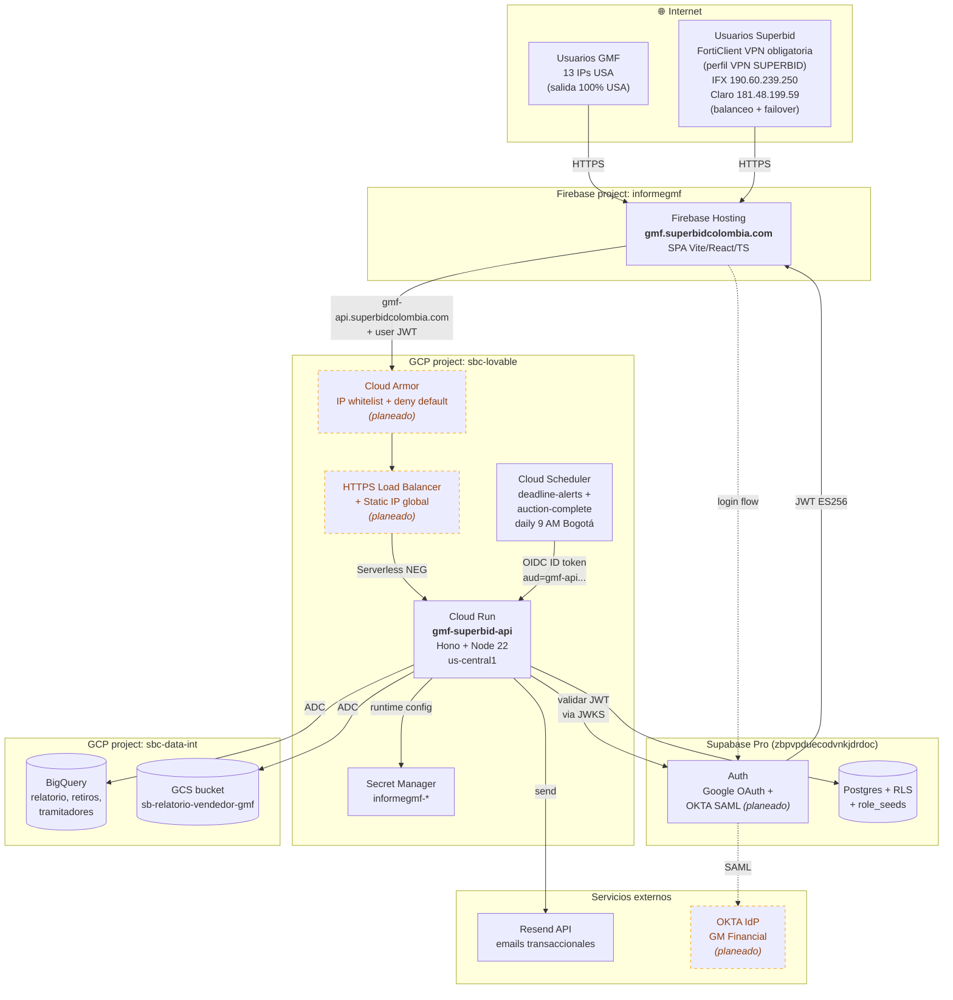
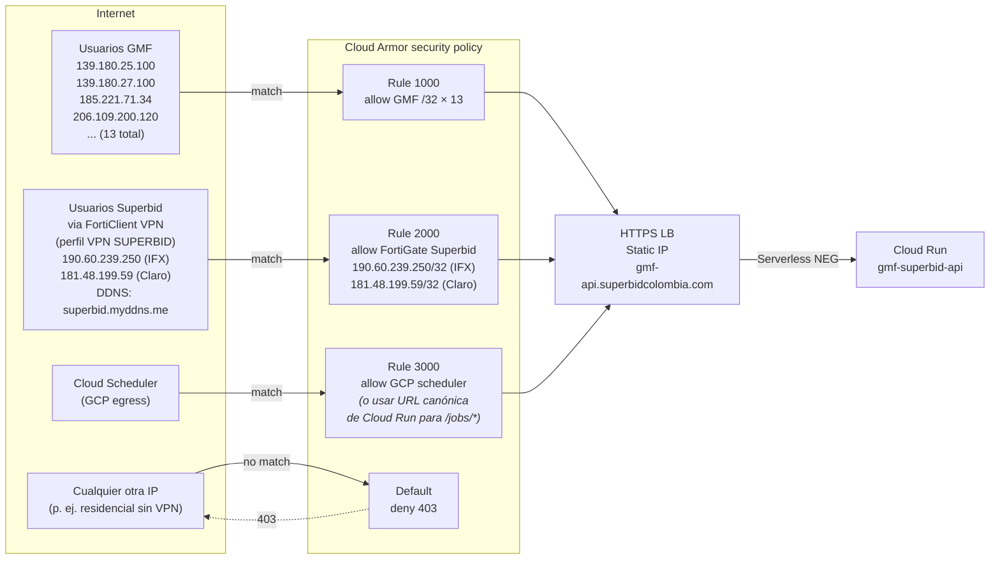
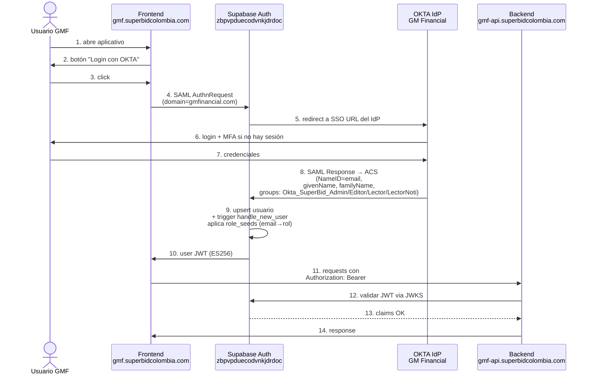
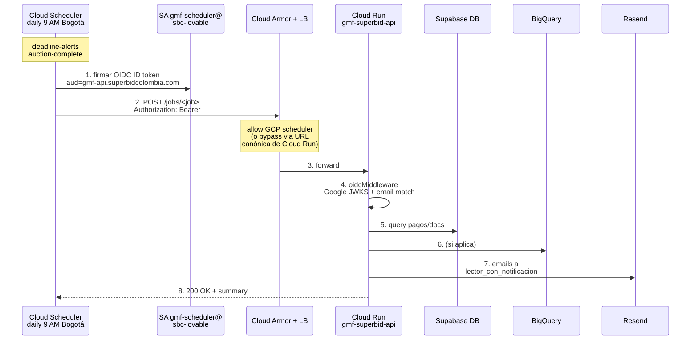

# Arquitectura — Informe GMF

Estado actual del sistema, post-migración a infraestructura propia (mayo 2026).

## Diagramas

Los diagramas están en Mermaid (renderizables directamente en GitHub o exportables a PNG con `mermaid-cli` para envío a GMF).

### Vista general (componentes)



### Network — IP whitelist (Cloud Armor)

Las **13 IPs de GMF** vienen de la respuesta de Edwin Rivera (8 may 2026): salida 100% USA, owners mezclan Vultr/Choopa, GM Financial directo y colocation.

Del **lado Superbid** se usa **FortiClient VPN corporativo de uso obligatorio** (perfil `VPN SUPERBID`, FortiGate corporativo). IT confirmó (10 may 2026) que el router Fortinet tiene **2 IPs fijas para balanceo + failover entre operadores**:

- **IFX**: `190.60.239.250/32` (IFX Networks Colombia, AS18747, Medellín)
- **Claro**: `181.48.199.59/32` (Telmex Colombia, AS14080, Bogotá-Suba)

El FortiGate cambia entre ambas dependiendo de cuál esté activa. DDNS `superbid.myddns.me` apunta dinámicamente a la IP en uso. Ambas IPs van al whitelist (`/32` cada una).



### Auth — OKTA SSO (SAML 2.0, planeado)

Reemplaza/complementa el flujo Google OAuth actual para usuarios `@gmfinancial.com`. El flujo Google OAuth se mantiene para usuarios `@superbid.com.co`.



### Jobs — Cloud Scheduler (OIDC)

Independiente del flujo de usuarios. No requiere whitelist GMF — los jobs se invocan desde GCP.



## Identificadores clave

### GCP projects

| Proyecto | Project ID | Project number | Rol |
|---|---|---|---|
| Backend Cloud Run + WIF + secretos | `sbc-lovable` | `604184934021` | Runtime principal |
| Frontend Firebase Hosting | `informegmf` | `104591804578` | Solo Hosting |
| Datos analíticos (BQ + bucket) | `sbc-data-int` | `858128435830` | BQ datasets, bucket GCS |

### Service Accounts

| SA | Proyecto home | Uso | Roles principales |
|---|---|---|---|
| `gmf-superbid-api@sbc-lovable.iam.gserviceaccount.com` | sbc-lovable | Runtime de Cloud Run | `bigquery.dataViewer`+`jobUser` en sbc-data-int, `storage.objectAdmin` en bucket, `secretmanager.secretAccessor` en informegmf-* |
| `gmf-scheduler@sbc-lovable.iam.gserviceaccount.com` | sbc-lovable | Firma OIDC tokens de Cloud Scheduler | `run.invoker` sobre el servicio |
| `github-deployer@sbc-lovable.iam.gserviceaccount.com` | sbc-lovable | Deploys vía GitHub Actions (WIF) | `cloudbuild.builds.editor`, `storage.admin`, `iam.serviceAccountUser` (sobre Compute SA), `run.admin` en sbc-lovable; `firebase.admin`, `firebasehosting.admin`, `serviceusage.serviceUsageConsumer` en informegmf |
| `lovable-bd-query@sbc-data-int.iam.gserviceaccount.com` | sbc-data-int | Legacy (no usar para nuevos servicios) | Tiene acceso a Drive Sheets externas que respaldan tablas BQ; el SA nuevo (`gmf-superbid-api`) también está en la ACL |

### Secretos en Secret Manager

Todos en `sbc-lovable`:

| Secreto | Contenido | Consumido por |
|---|---|---|
| `informegmf-supabase-url` | URL del proyecto Supabase Pro | Cloud Run env var |
| `informegmf-supabase-jwt` | JWT signing secret (legacy HS256) | No se usa post-migración (validamos via JWKS), pero se mantiene |
| `informegmf-supabase-secret` | Service role key | Cloud Run admin client |
| `informegmf-supabase-publishable` | Publishable anon key (formato `sb_*` nuevo) | No usado en runtime; el frontend usa la legacy JWT |
| `informegmf-supabase-password` | DB password | `supabase db push` para migraciones |
| `informegmf-resend` | Resend API key | Cloud Run jobs handlers |
| `informegmf-gcp-service` | (legacy) JSON key SA con `secretAccessor` | No se usa, runtime usa ADC |

En `sbc-data-int`:

| Secreto | Contenido |
|---|---|
| `lovable-bd-consulting` | JSON key del SA `lovable-bd-query` (legacy edge functions) |

### Recursos de despliegue

| Recurso | Detalle |
|---|---|
| Artifact Registry | `us-central1-docker.pkg.dev/sbc-lovable/informegmf` (Docker) |
| Cloud Run service | `gmf-superbid-api` en `us-central1`, min-instances=1, max-instances=5, 512 MiB, 1 CPU |
| Cloud Run domain mapping | `gmf-api.superbidcolombia.com` → `gmf-superbid-api`, cert managed |
| Firebase Hosting site | `informegmf.web.app` (default) + `gmf.superbidcolombia.com` (custom; cert SAN multi-tenant Firebase/Fastly emitido por Google Trust Services, válido hasta 2026-08-05; verificado 2026-05-10) |
| Workload Identity Pool | `projects/604184934021/locations/global/workloadIdentityPools/github` con provider `github` y `attribute_condition = assertion.repository == 'sb-dataops/informegmf'` |

### Cloud Scheduler jobs

| Job | Schedule | Endpoint | Auth |
|---|---|---|---|
| `send-deadline-alerts` | `0 9 * * *` America/Bogota | `POST https://gmf-api.superbidcolombia.com/jobs/deadline-alerts` | OIDC con `gmf-scheduler@sbc-lovable`, audience `https://gmf-api.superbidcolombia.com` |
| `notify-auction-complete` | `0 9 * * *` America/Bogota | `POST .../jobs/auction-complete` | Idem |

## Modelo de auth

| Path | Mecanismo | Validador |
|---|---|---|
| `GET /health` | público | — |
| `GET /api/*` | user JWT de Supabase (ES256) | `authMiddleware` valida vía Supabase JWKS (`https://<ref>.supabase.co/auth/v1/.well-known/jwks.json`); rechaza role=anon |
| `GET\|POST /fetch-bigquery` | idem | idem |
| `GET\|POST /gcs-documents` | idem | idem |
| `POST /jobs/*` | OIDC ID token de Google | `oidcMiddleware` valida vs Google JWKS, comprueba audience y email del SA (Cloud Scheduler emite los tokens con email = `gmf-scheduler@...`) |

CORS lista (configurada en `backend/env.production.yaml`):

```
http://localhost:8080
https://informegmf.web.app
https://informegmf.firebaseapp.com
https://gmf.superbidcolombia.com
```

## Roles de aplicación (`public.user_roles`)

Enum `public.app_role`: `admin`, `editor`, `lector`, `lector_con_notificacion`.

Auto-asignación al primer login: tabla `public.role_seeds (email, role, applied_at)` precarga los emails autorizados con su rol; el trigger `handle_new_user` aplica el seed cuando la persona hace login con Google por primera vez.

Para agregar un nuevo usuario antes de que entre:

```sql
INSERT INTO public.role_seeds (email, role) VALUES
  ('persona@superbid.com.co', 'lector')
ON CONFLICT (email, role) DO NOTHING;
```

Para reasignar después de que ya entró: panel `/admin` del frontend (solo visible para `admin`).

Trigger `enforce_allowed_email_domain` rechaza signups que no sean `@superbid.com.co` o `@gmfinancial.com`.

## Tablas BigQuery clave (en `sbc-data-int`)

| Lógico | Identificador BQ | Tipo |
|---|---|---|
| relatorio | `sbc-data-int.relatorio_bq.relatorio_actual` | TABLE nativa |
| retiros | `sbc-data-int.r_retiros.r_retiros_gmf_2025` | EXTERNAL — Google Sheet |
| servitram | `sbc-data-int.r_retiros_tramitadores.r_tramitadores_servitram_gmf` | EXTERNAL — Google Sheet |
| gestramites | `sbc-data-int.r_retiros_tramitadores.r_tramitadores_gestramites` | EXTERNAL — Google Sheet |
| consolidadoChan | `sbc-data-int.HubSpot_uploads.consolidadoChan` | TABLE nativa |

Las 3 tablas EXTERNAL respaldadas por Google Sheets exigen acceso Drive en el SA. Los 3 Sheets están compartidos como Viewer con `gmf-superbid-api@sbc-lovable.iam.gserviceaccount.com` (y aún con `lovable-bd-query@sbc-data-int.iam.gserviceaccount.com` heredado).

## Pendientes para cumplir requerimientos GM Financial

Estado actualizado al 2026-05-10, post-respuesta de Edwin Rivera (IT Senior Specialist GMF, 8 may 2026 — ver thread completo en `comunicaciones/`).

| Requerimiento | Estado | Bloqueante / Próximo paso |
|---|---|---|
| **IP whitelist (Cloud Armor)** | ✅ Ambas partes confirmadas | GMF: 13 IPs USA `/32` (8 may 2026). Superbid: 2 IPs Fortinet con balanceo + failover entre IFX (`190.60.239.250`) y Claro (`181.48.199.59`) confirmadas por IT (10 may 2026). Próximo paso: desplegar Cloud Armor + LB en modo `preview` 24-48h, luego switch a enforce. |
| **OKTA SSO — roles** | ✅ GMF aceptó mapeo: `admin → Okta_SuperBid_Admin`, `editor → Okta_SuperBid_Editor`, `lector → Okta_SuperBid_Lector`, `lector_con_notificacion → Okta_SuperBid_LectorNoti` | — |
| **OKTA SSO — atributos** | ✅ Confirmados por GMF: `email` (NameID o atributo), `givenName + familyName` (o `full_name`), `groups` | — |
| **OKTA SSO — metadata IdP** | ❌ pendiente | GMF debe enviar URL pública del metadata XML o el archivo XML exportado de OKTA. Sin esto Supabase Auth no puede configurar el SSO. |
| **OKTA SSO — usuarios y roles iniciales** | ❌ pendiente | Samuel Pinzón quedó de confirmar con qué usuarios + perfil arrancamos. |
| **OKTA SSO — cuenta de prueba** | ❌ pendiente | Necesaria para validar el flujo SSO antes de habilitar producción. |
| **OKTA SSO — confirmaciones a GMF** | ⏳ por enviar | Confirmar a Edwin: URL pública del aplicativo (`https://gmf.superbidcolombia.com`) + Callback (`/auth/v1/sso/saml/metadata`) + Redirect (`/auth/v1/sso/saml/acs`) — los datos coinciden con lo enviado en el primer correo. |
| **Diagrama de arquitectura** | ✅ este documento (sección "Diagramas" arriba) | Exportar a PNG/PDF y adjuntar al próximo correo a GMF. |
| **Plan de soporte/backups** | ⏳ por documentar runbook | Decisión de SLAs internos. |

### IPs whitelist GMF entregadas (8 may 2026)

```
139.180.25.100  /32   139.180.27.100  /32
139.180.25.120  /32   139.180.27.120  /32
185.221.71.34   /32
206.109.200.120 /32   206.109.201.120 /32
208.65.145.34   /32   208.81.69.34    /32   208.81.70.34   /32
63.96.91.120    /32   63.96.138.120   /32
64.117.235.120  /32
```

Nota: GMF aclaró que su salida a internet es **100% por Estados Unidos**. Owners de los rangos mezclan Vultr/Choopa, GM Financial directo y colocation USA — son los proxies/NAT corporativos de GMF, no IPs colombianas.

### IPs whitelist Superbid entregadas (10 may 2026)

Router Fortinet corporativo con balanceo + failover entre 2 operadores:

```
190.60.239.250 /32   IFX Networks Colombia  (AS18747, Medellín)
181.48.199.59  /32   Telmex / Claro CO      (AS14080, Bogotá-Suba)
```

DDNS `superbid.myddns.me` apunta a la IP en uso en cada momento (verificado 2026-05-10: resuelve a `181.48.199.59`, es decir Claro activo). Cuando el FortiGate cambia de operador (caída de IFX o Claro), el tráfico sale por la otra IP — por eso **ambas deben estar en el whitelist**, no solo la que esté activa hoy.

Todos los empleados de Superbid acceden al aplicativo conectados a **FortiClient VPN, perfil `VPN SUPERBID`** (obligatorio).

Drafts de correo a GM y thread completo del intercambio en [`comunicaciones/`](./comunicaciones/).
